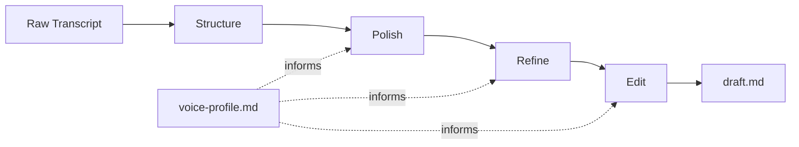
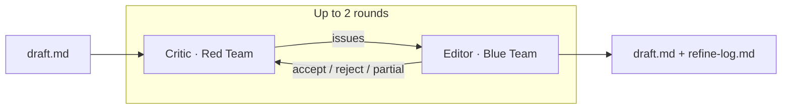

# Verbatim

LLMs are great at writing blog posts. They're terrible at sounding like you.

I give a lot of talks and do interviews. The content is already there, in the transcript. But turning a transcript into a blog post that actually sounds like me? That's the hard part. Every time I asked an LLM to "turn this into a blog post," it came back sounding like LinkedIn. Clean, polished, and completely not me.

So I built a pipeline that edits instead of writes. It takes my transcripts and shapes them into blog posts, but every word traces back to something I actually said. No ideas added, no opinions inserted, no "in today's rapidly evolving landscape."

## How it works



Five skills, each doing one thing.

**Voice profile.** Feed it a few transcripts or blog posts and it extracts how you talk. Your tone, the words you reach for, your sentence rhythm, how you open and close pieces. This becomes the authority that the rest of the pipeline follows. You only need to do this once, then update it as you write more.

**Structure.** Takes a raw transcript and cleans it up. Removes the ums, the false starts, the circular repetition where you said the same thing twice while finding your words. Finds the best hook, identifies natural sections, and tags the gold, the sharp analogies and strong opinions that make the post worth reading. Two modes: presentation (preserve your structure) and interview (extract a solo narrative from Q&A).

**Polish.** The editor-not-writer pass. Tightens sentences, smooths transitions, formats it as a blog post with Astro frontmatter. But it can't add ideas you didn't express, strengthen claims beyond what you said, or formalize your casual language. "Super cool" stays "super cool." There's also an anti-slop list, a big list of banned phrases that signal AI-generated content. If "let's dive in" or "game-changer" sneaks in, it gets caught.

**Refine.** This is the adversarial step. Two sub-agents: a Critic (Red Team) that stress-tests the draft against eight quality principles, things like "does the opening earn attention" and "are claims backed by specifics." Then an Editor (Blue Team) that processes the feedback while protecting your voice. The Editor can reject Critic suggestions. If the Critic says "super cool is too informal," the Editor says "that's the author's voice, not sloppiness" and moves on. The tension between them is the point.



**Polish pipeline.** Chains all three (structure, polish, refine) in one command. This is what you'll use most of the time.

**Edit.** A browser-based visual editor for the final human pass. Opens your draft in a BlockNote editor where you can type changes directly or select text and describe what you want changed — Claude edits it for you, following your voice profile. Shows an inline diff so you can accept or reject each AI edit. This is the last step before publishing.

## Workflow

```
1. /verbatim:voice-profile transcript1.md transcript2.md transcript3.md
   → Builds voice-profile.md at project root

2. /verbatim:polish-pipeline new-transcript.md --mode presentation
   → Runs structure → polish → refine → produces tmp-new-transcript/draft.md

3. /verbatim:edit tmp-new-transcript/draft.md
   → Opens visual editor in browser for final human editing pass

4. Move tmp-new-transcript/draft.md to src/content/blog/slug.md when happy
```

The voice profile is optional. The pipeline works without it using sensible defaults. But the results are noticeably better with one. More writing samples, better profile.

## Requirements

- [Claude Code](https://code.claude.com/) with an active subscription
- [Bun](https://bun.sh/) runtime (for the editing UI)

```bash
# Install Bun if you don't have it
curl -fsSL https://bun.sh/install | bash
```

## Editing UI Setup

The editing UI needs a one-time dependency install:

```bash
cd editing-ui && bun install
```

After that, just use `/verbatim:edit draft.md` and the skill handles building and launching.

### Keyboard Shortcuts

| Shortcut | Action |
|----------|--------|
| Cmd+J | Open AI edit panel (select text first) |
| Escape | Close edit panel / reject changes |
| Enter | Submit edit instruction |

## Installation

From GitHub:

```bash
claude plugin marketplace add jesgarram/verbatim
claude plugin install verbatim@verbatim-marketplace
```

For local development:

```bash
claude --plugin-dir ./verbatim
```

## What comes out

Everything lands in `tmp-{article}/` at the project root:
- `clean.md` from the structure step
- `draft.md`, the final blog post after polish and refine
- `refine-log.md`, the full record of what the Critic found and what the Editor did about it

You iterate on `draft.md` until it sounds like you. Then move it to your blog and delete the tmp folder.

## Make it yours

Because it's all just markdown files, you can adjust everything. Change the anti-slop list, tweak the refinement principles, add your own constraints. The pipeline is a starting point, not a locked box.

## License

MIT
