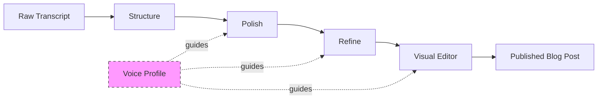
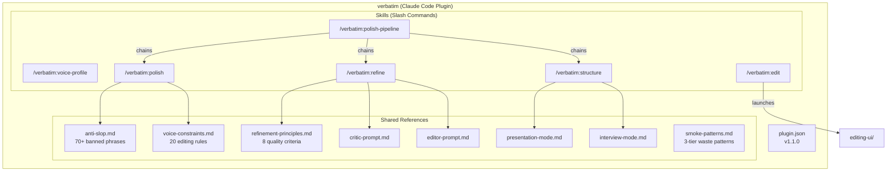
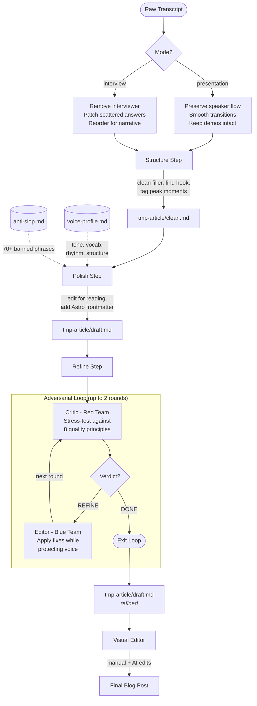
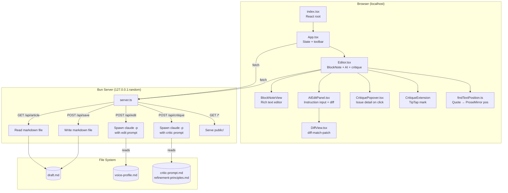
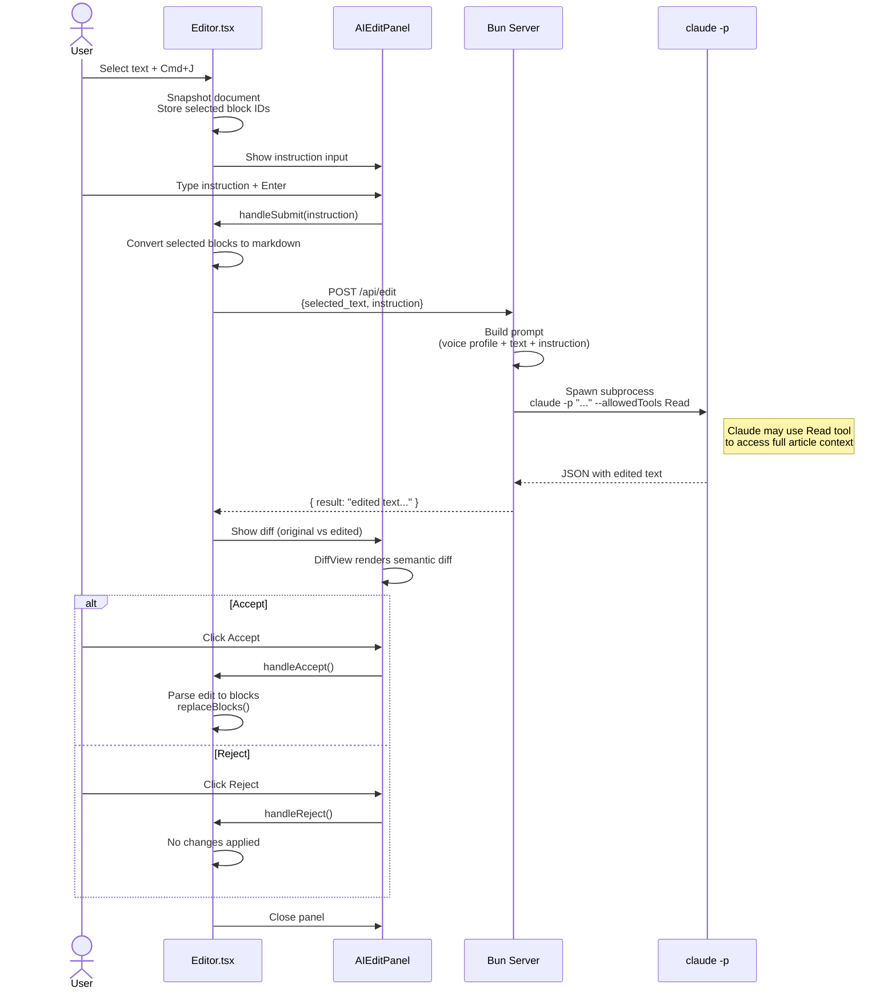
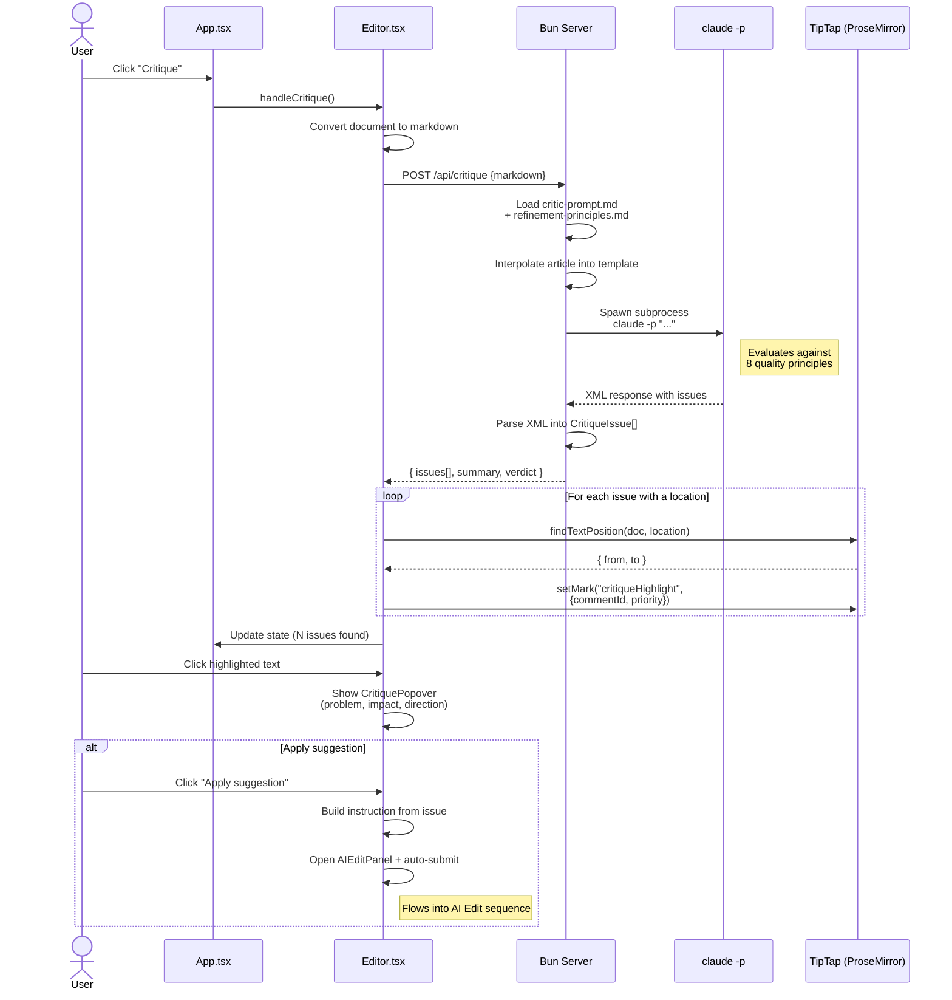
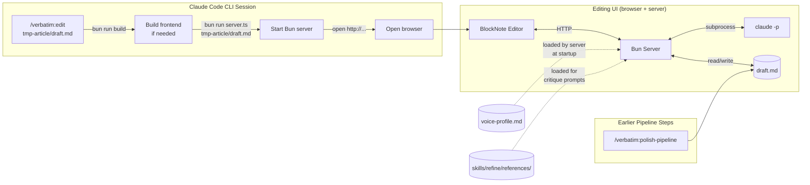
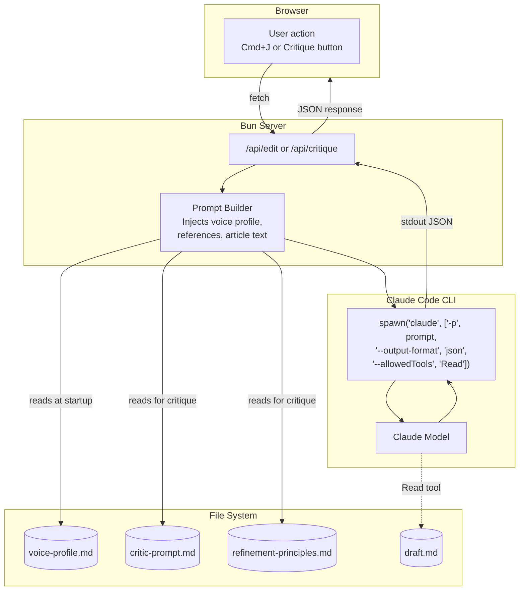
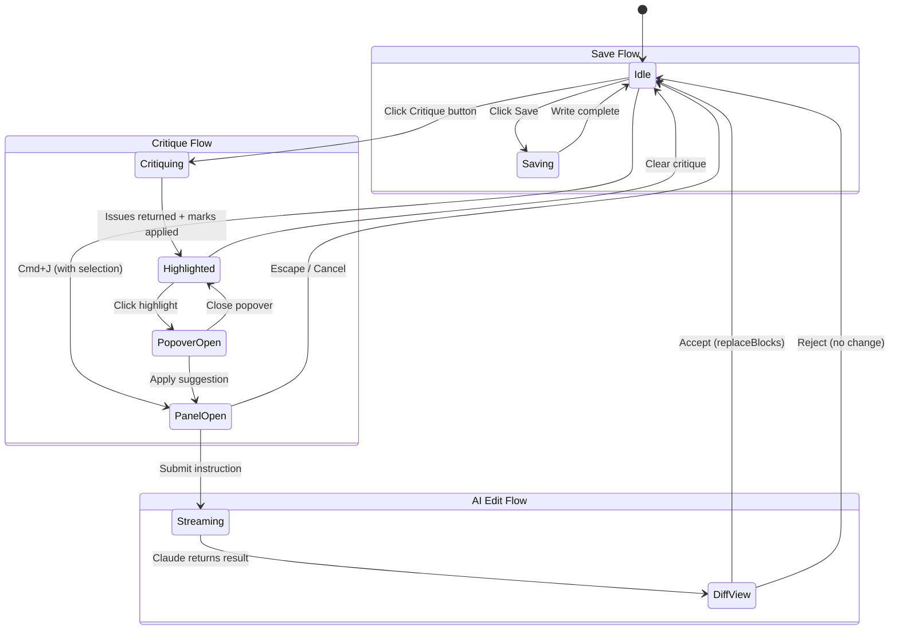
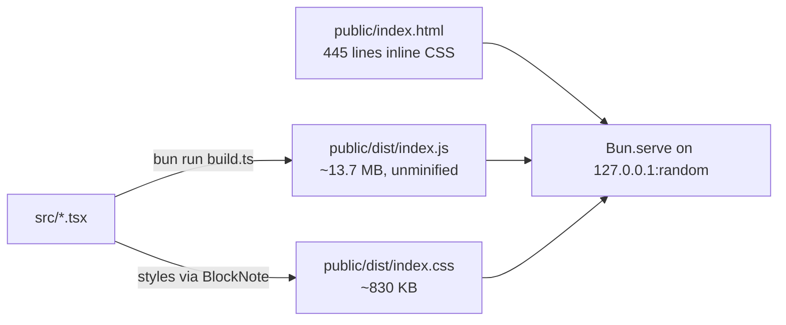

# Verbatim Architecture

> Transcript-to-blog pipeline with voice-preserving AI editing.
> Last updated: 2026-04-12

---

## 1. System Overview

Verbatim is a Claude Code plugin that converts raw transcripts into polished, voice-authentic blog posts through a multi-stage pipeline, then provides a browser-based visual editor for final human refinement.



**Hard constraint:** No Anthropic API keys. All AI runs through the Claude Code CLI (`claude -p`) via the user's subscription.

---

## 2. Repository Structure

```
verbatim/
├── .claude-plugin/
│   ├── plugin.json              # Plugin manifest (name, version, author)
│   └── marketplace.json         # Claude marketplace distribution config
├── .claude/
│   └── settings.local.json      # Permission scoping (WebSearch, WebFetch domains)
├── skills/
│   ├── voice-profile/SKILL.md   # Extract speaker voice from samples
│   ├── structure/SKILL.md       # Clean transcript into structured draft
│   │   └── references/          # presentation-mode.md, interview-mode.md
│   ├── polish/SKILL.md          # Structured draft -> near-publishable post
│   │   └── references/          # voice-constraints.md, anti-slop.md
│   ├── refine/SKILL.md          # Adversarial Critic/Editor improvement loop
│   │   └── references/          # critic-prompt.md, editor-prompt.md, refinement-principles.md, smoke-patterns.md
│   ├── polish-pipeline/SKILL.md # Chains structure -> polish -> refine
│   └── edit/SKILL.md            # Launches the visual editing UI
├── editing-ui/
│   ├── server.ts                # Bun HTTP server (API + static files)
│   ├── build.ts                 # Bun bundler config
│   ├── package.json             # Dependencies (BlockNote, React, diff-match-patch)
│   ├── public/
│   │   ├── index.html           # HTML shell + all CSS (445 lines inline)
│   │   └── dist/                # Build output (index.js, index.css)
│   ├── src/
│   │   ├── index.tsx            # React entry point
│   │   ├── App.tsx              # Root component, toolbar, state management
│   │   ├── Editor.tsx           # BlockNote integration, AI edit, critique
│   │   ├── AIEditPanel.tsx      # Instruction input, streaming, diff display
│   │   ├── DiffView.tsx         # Side-by-side diff (diff-match-patch)
│   │   ├── CritiquePopover.tsx  # Issue detail popover on highlight click
│   │   ├── critiqueExtension.ts # TipTap mark for inline critique highlights
│   │   └── findTextPosition.ts  # ProseMirror text location utility
│   └── tests/
│       ├── markdown-roundtrip.ts
│       └── sample-draft.md
├── context/
│   ├── exports/                 # Architecture Decision Records
│   └── plans/                   # Implementation plans
├── assets/                      # Pipeline diagrams (HTML)
└── README.md
```

---

## 3. Plugin & Skill Architecture

Verbatim is a Claude Code plugin. Skills are defined as `SKILL.md` files with YAML frontmatter that Claude Code discovers and exposes as slash commands.



### Skill Summary

| Skill | Trigger | Input | Output |
|-------|---------|-------|--------|
| `voice-profile` | "extract voice" | Transcript/writing files | `voice-profile.md` |
| `structure` | "structure this" | Raw transcript + `--mode` | `tmp-{article}/clean.md` |
| `polish` | "polish this" | Structured draft | `tmp-{article}/draft.md` |
| `refine` | "refine this" | Polished draft | `tmp-{article}/draft.md` (overwritten) + `refine-log.md` |
| `polish-pipeline` | "full polish" | Raw transcript + `--mode` | All of the above, sequentially |
| `edit` | "open editor" | Any markdown file | Updated file on disk |

---

## 4. Full Pipeline Flow



### Temporary Workspace

All artifacts live in `tmp-{article}/` at the project root:

| File | Producer | Description |
|------|----------|-------------|
| `clean.md` | Structure | Cleaned, organized transcript |
| `draft.md` | Polish -> Refine | Blog post (overwritten by refine) |
| `refine-log.md` | Refine | Changelog of Critic/Editor decisions |

---

## 5. Editing UI Architecture

The editing UI is a self-contained web application launched by the `/verbatim:edit` skill. It is an ephemeral localhost server -- spawned per editing session, no persistence beyond the markdown file on disk.

### Tech Stack

| Layer | Technology | Purpose |
|-------|-----------|---------|
| Runtime | Bun | Server, bundler, TS execution |
| Frontend | React 19 + BlockNote 0.46 | Notion-style block editor |
| Rich text | TipTap (via BlockNote) + ProseMirror | Document model, marks, extensions |
| Diffing | diff-match-patch | Semantic diff for accept/reject |
| AI | Claude Code CLI (`claude -p`) | Edit and critique via subprocess |
| Build | Bun.build | Single-file bundle, no Vite |

### Component Tree



---

## 6. Server API

The Bun server (`editing-ui/server.ts`) binds to `127.0.0.1` on a random port. It takes the markdown file path as a CLI argument.

### Endpoints

#### `GET /api/article`
Returns the markdown file content as plain text.

#### `POST /api/save`
Accepts raw markdown as the request body. Writes it to the file on disk. Returns `{ ok: true }`.

#### `POST /api/edit`
AI-powered text editing.

```
Request:  { selected_text: string, instruction: string }
Response: { result: string }
```

Internally:
1. Builds a prompt with voice profile (if found) + selected text + instruction
2. Spawns `claude -p "<prompt>" --output-format json --allowedTools "Read"`
3. Parses JSON output, extracts `result` field

#### `POST /api/critique`
AI-powered article critique.

```
Request:  { markdown: string }
Response: { issues: CritiqueIssue[], summary: string, verdict: string }
```

Internally:
1. Loads `critic-prompt.md` and `refinement-principles.md` from `skills/refine/references/`
2. Interpolates the article markdown into the prompt template
3. Spawns `claude -p "<prompt>" --output-format json`
4. Parses the XML response into structured issues

### Voice Profile Discovery

The server walks up to 5 parent directories from the markdown file looking for `voice-profile.md`. If found, it's injected into every AI edit prompt inside `<voice-profile>` tags. If not found, the prompt instructs Claude to match the text's existing tone.

---

## 7. AI Edit Flow



### Edit Prompt Structure

```
<voice-profile>
  [contents of voice-profile.md, if found]
</voice-profile>

You are a prose editor. Your job is to edit the selected text...

Rules:
- Return ONLY the edited text. No explanations.
- NEVER return empty text.
- Preserve the speaker's authentic voice.
- Do not add ideas not in the original.
- Do not use AI-sounding phrases.

The full article is at: /path/to/draft.md
You may Read this file if you need surrounding context.

<selected-text>
[the text the user selected]
</selected-text>

<instruction>
[what the user typed]
</instruction>

Return the edited text now:
```

### Recovery Mechanism

Before any AI edit, `Editor.tsx` snapshots the entire document via `JSON.parse(JSON.stringify(editor.document))`. If the user rejects the edit, the original blocks are untouched (the edit is only applied on Accept). If `replaceBlocks()` fails, a fallback rebuilds the entire document with a string replacement.

---

## 8. Critique System Flow



### Critique Issue Schema

```typescript
interface CritiqueIssue {
  id: string;                              // "critique-0", "critique-1", ...
  priority: "high" | "medium" | "low";     // From XML attribute
  location: string;                        // Exact quote from the draft
  principle: string;                       // e.g. "6. No Filler, No Throat-Clearing"
  problem: string;                         // What's wrong
  readerImpact: string;                    // How the reader is affected
  direction: string;                       // Compass heading for the fix
}
```

### Text Matching Algorithm (`findTextPosition.ts`)

The critique system needs to map quoted text from Claude's response to exact ProseMirror document positions. This is non-trivial because text spans formatting boundaries (bold, italic, etc.).

```mermaid
flowchart TD
    A[Build flat text array<br/>+ parallel position map] --> B{Exact match?}
    B -->|Yes| C[Return {from, to}<br/>from position map]
    B -->|No| D[Normalize whitespace<br/>in both strings]
    D --> E{Normalized match?}
    E -->|Yes| F[Walk original text<br/>Map normalized index<br/>back to original positions]
    F --> C
    E -->|No| G[Return null<br/>Log warning]
```

The algorithm traverses all text nodes in the ProseMirror document, building a flat string with a parallel array mapping each character index to its absolute document position. It tries an exact match first, then falls back to whitespace-normalized matching.

### Critique Highlight Extension (`critiqueExtension.ts`)

A custom TipTap mark that renders as colored `<span>` elements:

- **high** priority: red background + dotted underline
- **medium** priority: orange background + dotted underline
- **low** priority: gray background + dotted underline

The mark is registered with `blocknoteIgnore: true` so BlockNote doesn't interfere with it during serialization.

---

## 9. How the UI Connects to Verbatim



The editing UI is the final stage in the verbatim pipeline. It consumes the `draft.md` produced by the polish-pipeline and produces the final publishable version. The `/verbatim:edit` skill orchestrates the launch:

1. **Validate** -- checks the file argument exists
2. **Build** -- runs `bun run build` in `editing-ui/` (skipped if output is fresh)
3. **Launch** -- starts the Bun server as a background process with the file path
4. **Open** -- opens the browser to the server URL
5. **Inform** -- tells the user the keyboard shortcuts and how to save/stop

---

## 10. How the UI Talks to Claude

There is no direct API connection to Anthropic. Every AI interaction goes through the Claude Code CLI as a subprocess.



### Two Claude Invocation Patterns

| Pattern | Endpoint | CLI Flags | Prompt Source | Tools Allowed |
|---------|----------|-----------|---------------|---------------|
| **Edit** | `/api/edit` | `--output-format json --allowedTools "Read"` | `buildEditPrompt()` in server.ts | `Read` (for article context) |
| **Critique** | `/api/critique` | `--output-format json` | `critic-prompt.md` template | None |

Both patterns:
- Spawn `claude` as a child process
- Collect stdout/stderr via pipe
- Parse the JSON wrapper (`{ result: "..." }`)
- Return structured data to the frontend

The **Edit** pattern allows Claude to use the `Read` tool to access the full article file for surrounding context. The **Critique** pattern sends the entire article in the prompt, so no tools are needed.

---

## 11. Frontend State Management

No external state library. All state lives in React components via `useState` and `useRef`.



### Key State in Editor.tsx

| State | Type | Purpose |
|-------|------|---------|
| `aiPanelVisible` | boolean | AI edit panel shown |
| `streaming` | boolean | Waiting for Claude response |
| `hasResult` | boolean | Edit result ready for review |
| `editResult` | string | The edited text from Claude |
| `originalText` | string | Pre-edit text for diff |
| `documentSnapshotRef` | Ref\<Block[]\> | Full doc snapshot for recovery |
| `selectedBlockIdsRef` | Ref\<string[]\> | Which blocks are being edited |
| `critiqueIssues` | CritiqueIssue[] | Active critique annotations |
| `selectedCommentId` | string \| null | Which highlight popover is open |

---

## 12. Build & Deployment



Build is a single `Bun.build()` call:
- Entry: `src/index.tsx`
- Output: `public/dist/`
- No minification (easier debugging)
- Inline source maps
- Target: browser

The server binds to `127.0.0.1` (localhost only) on port `0` (OS-assigned random port). This means:
- No network exposure
- No port conflicts
- URL is printed to stdout for the skill to open

---

## 13. Design Decisions

### Editor, Not Writer
The core philosophy throughout the system: **every word must trace back to something the speaker said.** The AI can rephrase, reorder, cut, and smooth -- but it cannot add ideas, examples, or opinions the speaker didn't express.

### No API Keys
All AI goes through `claude -p` (Claude Code CLI). This means:
- No API key management or rotation
- No token counting or billing complexity
- Each invocation is stateless (no session management)
- Trade-off: ~5-10 second cold-start per edit

### Markdown as Source of Truth
The file on disk is always markdown. BlockNote parses it into blocks for editing, then serializes back to markdown on save. The `markdown-roundtrip.ts` test validates that this conversion is not lossy.

### Ephemeral Server
The Bun server exists only during an editing session. No database, no persistent state, no background processes. When the user presses Ctrl+C, it's gone.

### Adversarial Refinement
The Critic (Red Team) and Editor (Blue Team) create productive tension:
- The Critic optimizes for reader experience
- The Editor protects the author's voice
- Neither can override the other unilaterally

This prevents both under-editing (Critic alone would flag but not fix) and over-editing (Editor alone would smooth away personality).

### Anti-Slop as a First-Class Concern
70+ banned phrases across 6 categories, checked at both the polish and refine stages. The rule: if it could appear on LinkedIn, in a press release, or in ChatGPT output -- it's slop. Cut it.

---

## 14. Quality Guardrails

The system enforces quality at multiple levels:

```mermaid
flowchart TD
    subgraph Structure
        G1[Remove filler words]
        G2[Tag peak moments]
    end

    subgraph Polish
        G3[Voice constraints<br/>20 rules]
        G4[Anti-slop check<br/>70+ banned phrases]
    end

    subgraph Refine
        G5[8 refinement principles]
        G6[Smoke patterns<br/>3-tier waste detection]
        G7[Critic/Editor tension]
    end

    subgraph Edit UI
        G8[Voice profile in<br/>every AI prompt]
        G9[Accept/Reject gate<br/>Human has final say]
    end

    Structure --> Polish --> Refine --> Edit UI
```

### The 8 Refinement Principles

1. **Opening earns attention** -- first two paragraphs give the reader a reason to stay
2. **Every section earns its length** -- no redundancy, no wandering
3. **Claims backed by specifics** -- examples, numbers, stories, analogies
4. **Transitions carry the reader** -- natural movement between sections
5. **The piece lands somewhere** -- reader can answer "what's the one thing?"
6. **No filler, no throat-clearing** -- no hedging, no preamble
7. **Technical concepts accessible** -- understood through analogy or example
8. **Pacing keeps moving** -- varied paragraph length, consistent energy

---

## 15. Key File Reference

| File | Line Count | Role |
|------|-----------|------|
| `editing-ui/server.ts` | 341 | Bun HTTP server, API endpoints, Claude CLI integration |
| `editing-ui/src/Editor.tsx` | 378 | Core editor component, AI edit + critique orchestration |
| `editing-ui/src/App.tsx` | 117 | Root component, toolbar, global state |
| `editing-ui/src/AIEditPanel.tsx` | 114 | Edit instruction form + diff display |
| `editing-ui/src/DiffView.tsx` | 29 | Semantic diff rendering |
| `editing-ui/src/CritiquePopover.tsx` | 99 | Issue detail popover |
| `editing-ui/src/critiqueExtension.ts` | 56 | TipTap mark for highlights |
| `editing-ui/src/findTextPosition.ts` | 98 | Quote-to-position mapping |
| `editing-ui/public/index.html` | ~445 | HTML shell + all CSS |
| `skills/refine/references/critic-prompt.md` | 92 | Critic sub-agent prompt template |
| `skills/polish/references/anti-slop.md` | ~70+ entries | Banned AI phrase list |
| `skills/polish/references/voice-constraints.md` | ~20 rules | Editorial guardrails |
