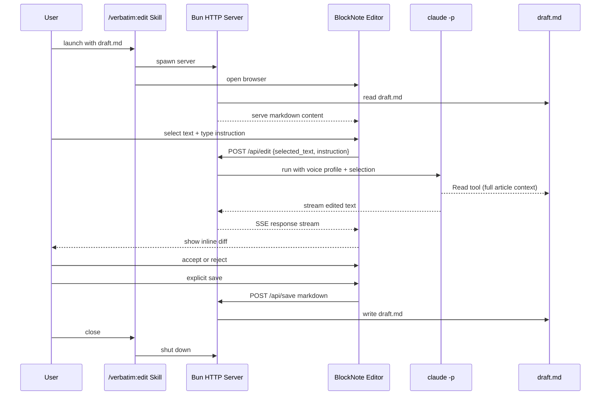

# Editing UI for Post-Pipeline Article Refinement

**Status**: Proposed

## Context

Verbatim's pipeline (structure -> polish -> refine) produces a near-publishable draft, but the author always needs a final editing pass. Today this happens through back-and-forth conversation in Claude Code: "change this paragraph," "tighten that up," "add a section about X." This is slow because:

1. **No pointing** — you can't select text visually, you have to describe which paragraph you mean
2. **No manual editing** — you can't just type a fix yourself; everything goes through Claude
3. **No inline feedback** — you can't see what changed at a glance

The author needs both AI-assisted edits (describe what to change, Claude does it) and manual edits (just type it) in the same interface. The voice profile must guide AI edits. This is the final human gate before publication.

**Constraints:**
- No Anthropic API keys — must use Claude Code CLI (`claude -p`) via subscription
- Markdown is the file format; the article will later migrate to Astro
- Must be launchable from a Claude Code skill (`/verbatim:edit`)
- The author doesn't care about edit history — ship the final file and move on

## Decision

Build a local web-based editing UI as a new verbatim skill (`/verbatim:edit`) with:

- **BlockNote** as the editor — Notion-style block editor with native AI workflow support (select -> instruct -> stream -> accept/reject), plus full manual editing. Reads and writes markdown.
- **Bun HTTP server** — ephemeral localhost server launched by the skill, serves the frontend and proxies AI requests. Shuts down when the user is done.
- **Claude Code CLI (`claude -p`)** — invoked per edit request. Voice profile + selected text + instruction sent as prompt. Stateless — no session persistence. Can use Read tool to access full article context if needed.
- **Inline diff** — accepted/rejected changes shown inline in the editor (Notion-style), not in a separate panel.
- **Browser-based** — opens in the user's default browser. No Tauri/Electron overhead.

### Workflow

```
/verbatim:polish-pipeline transcript.md
  -> tmp-{article}/draft.md

/verbatim:edit tmp-{article}/draft.md
  -> Bun server starts on localhost
  -> Browser opens with BlockNote loaded with draft.md
  -> Author edits (manual + AI-assisted)
  -> Author saves -> draft.md updated on disk
  -> Author closes -> server shuts down

Author moves draft.md to blog repo -> publish
```



## Consequences

**Positive:**
- Visual text selection eliminates "which paragraph do you mean?" friction
- Manual + AI editing in one interface — author keeps full control of voice
- Stateless `claude -p` is simple: no session management, no API keys, no state to clean up
- BlockNote's built-in AI scaffolding (select -> instruct -> accept/reject) reduces custom code
- Ephemeral server means zero persistent infrastructure

**Negative:**
- `claude -p` has startup overhead per edit (~5-10 seconds) — no prompt caching
- BlockNote's markdown round-tripping may be lossy (formatting, line breaks, frontmatter)
- Inline diff requires custom BlockNote extension — higher implementation effort than a side panel

**Mitigations:**
- Latency: can upgrade to `claude --resume` sessions later if speed becomes a problem
- Markdown fidelity: validate round-tripping with real drafts as step zero before building anything else
- Inline diff: start with a simpler accept/reject UX, iterate toward full inline diff

## Risks

**1. BlockNote markdown round-tripping is lossy**
- What goes wrong: Loading a draft into BlockNote and saving it back produces different markdown — reformatted headings, lost line breaks, mangled syntax
- Signal to watch: Run a diff between input and output markdown with a real draft. Any unexpected changes are the signal.
- What to do: Test before building anything else. If round-tripping is broken, evaluate alternatives (CodeMirror with a rich preview, or contribute a fix upstream).

**2. AI edit latency kills the flow**
- What goes wrong: Each `claude -p` call takes 5-10 seconds. After 3-4 edits the author gives up and goes back to raw Claude Code conversation.
- Signal to watch: Time the round-trip during first real editing session. If it's consistently >8 seconds, it's too slow.
- What to do: Switch to `claude --resume` to keep a session alive, or explore streaming the response so the user sees progress immediately.

**3. Editor UX feels clunky**
- What goes wrong: BlockNote's block model doesn't map cleanly to the author's mental model of their article. Selecting text is fiddly, accepting edits is too many clicks.
- Signal to watch: Author avoids the UI and goes back to terminal within the first week.
- What to do: Simplify the UX — fewer clicks to trigger an edit, keyboard shortcuts (Cmd+E), reduce visual noise.
